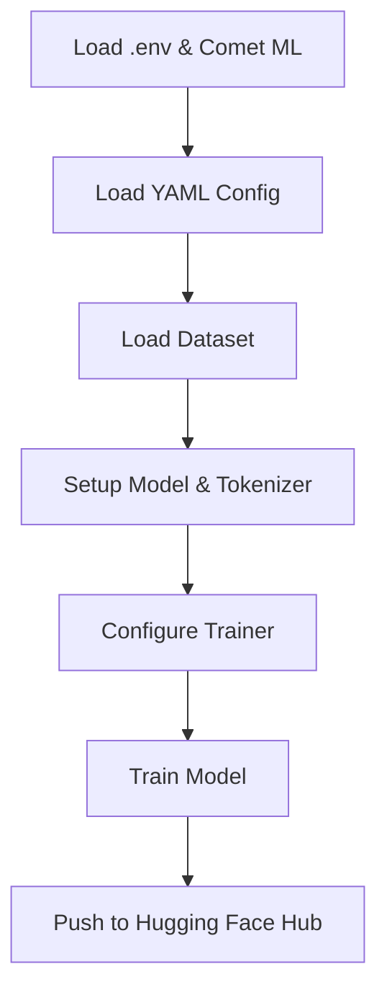

# Training Pipeline

This module orchestrates the end-to-end training of a language model using Unsloth and Hugging Face Datasets.

## Overview
- Loads configuration and hyperparameters from YAML
- Authenticates with Comet ML for experiment tracking
- Loads and prepares the dataset
- Sets up the model and tokenizer
- Configures the trainer and starts training
- Pushes the trained model and tokenizer to Hugging Face Hub

## Main Steps
1. **Environment Setup**: Loads environment variables and Comet ML credentials.
2. **Configuration**: Loads model and training configs from YAML using `QwenHyperparameterConfig` and `UnslothTrainerConfig`.
3. **Dataset Loading**: Loads the training dataset from Hugging Face Hub.
4. **Model Setup**: Uses `setup_model()` from `src.utils` to initialize the model and tokenizer.
5. **Trainer Initialization**: Sets up `UnslothTrainer` with all arguments and data collator.
6. **Training**: Calls `trainer.train()` to start the training loop.
7. **Model Upload**: Pushes the trained model and tokenizer to the Hugging Face Hub.

## Flow Diagram


## Usage Example
```python
# Run the training pipeline from the project root:
uv run src/training.py
```

## Key Dependencies
- `unsloth`
- `transformers`
- `datasets`
- `comet_ml`
- `src.utils`, `src.settings`

## Notes
- Requires `HF_TOKEN` and `COMET_API_KEY` as environment variables.
- Training parameters and model selection are controlled via `configs/training.yaml`.